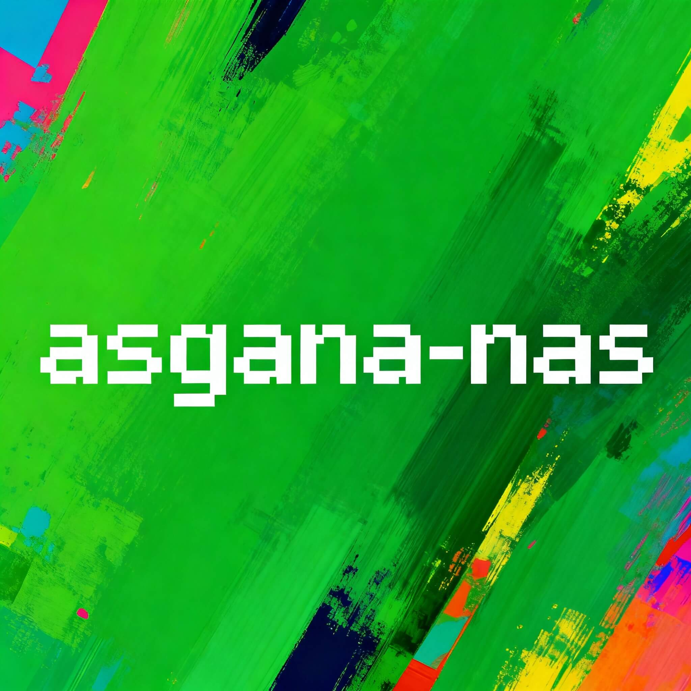
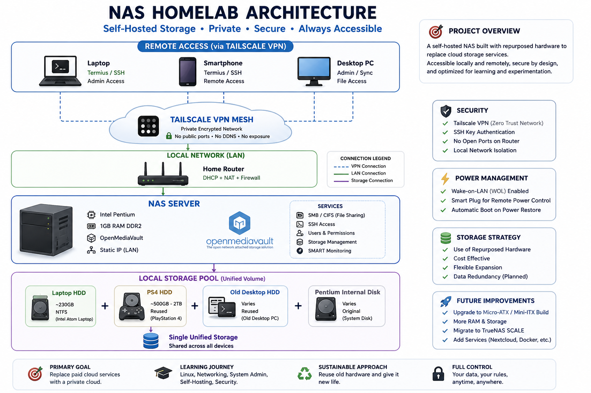
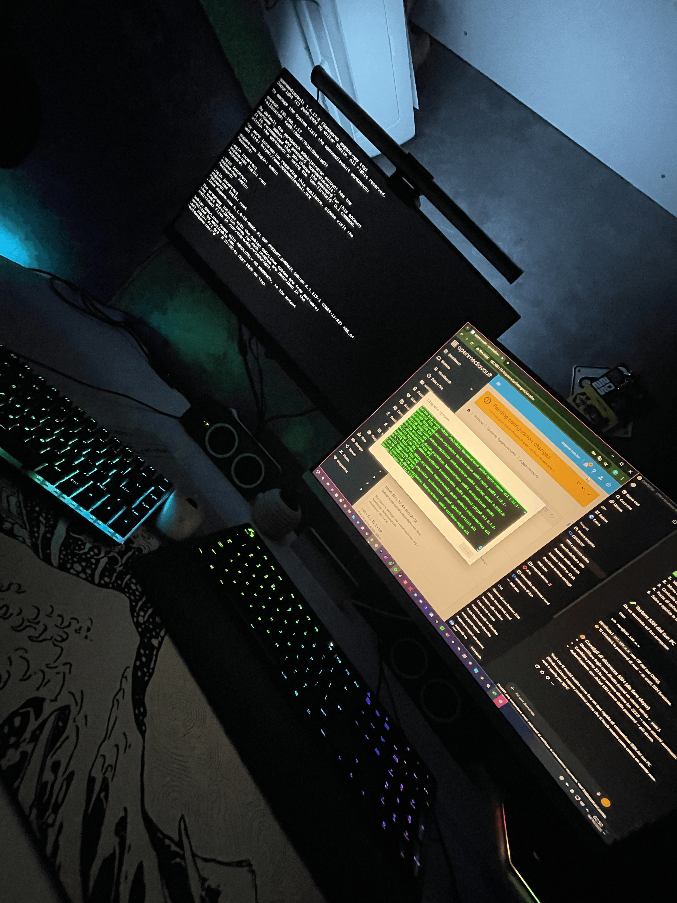

# NAS Homelab – Self-Hosted Storage Infrastructure (DIY Project)

<p align="center">
  
</p>


## Overview

Questo progetto consiste in un sistema NAS self-hosted costruito recuperando hardware legacy.
L'obiettivo principale è sostituire i servizi cloud commerciali (Google Drive, iCloud) con una soluzione di storage privata, sempre disponibile e accessibile sia localmente che da remoto.

Il progetto è stato concepito anche come ambiente di test e apprendimento per esplorare il networking, l'amministrazione di sistemi Linux e la gestione di infrastrutture remote.

---

## Tech Stack

- **OS**: Lubuntu Server 22.04 (CLI-only)
- **NAS Software**: OpenMediaVault (OMV)
- **Remote Access**: Tailscale VPN (WireGuard-based)
- **Hardware**: Desktop Intel Pentium desktop (1GB RAM DDR2), 230GB HDD (NTFS)
- **Protocols**: SMB/CIFS per il file sharing, SSH per la gestione remota

## Objectives

Creare un sistema di storage privato "always-on".

Eliminare la dipendenza da servizi cloud a pagamento.

Abilitare l'accesso remoto sicuro da più dispositivi (PC, Smartphone).

Approfondire le competenze su Linux, reti e amministrazione di sistema.

Massimizzare l'utilizzo di hardware obsoleto riducendo l'e-waste.

---

## System Architecture & Design

L'infrastruttura è stata progettata seguendo tre pilastri fondamentali:

Zero-Exposure Networking: Invece di esporre porte sul router domestico (Port Forwarding), il NAS utilizza un tunnel crittografato Tailscale. Questo permette un accesso remoto sicuro (Point-to-Point) da smartphone e PC come se fossero in rete locale.

Efficient Storage: Utilizzo di un file system NTFS su disco interno da 230GB, configurato per la massima compatibilità e recupero dati in scenari di emergenza.

Hybrid Power Control: Per superare i limiti del Wake-on-LAN (WoL) tradizionale su hardware datato, è stata implementata una soluzione combinata: **Smart Plug + BIOS "Restore on AC Power"**, permettendo il cold-boot remoto da qualsiasi parte del mondo.

- Main NAS: Intel Pentium desktop (OpenMediaVault)
- Storage expansion: 230GB HDD from Intel Atom laptop (NTFS)
- Network: LAN connection via router (static IP)
- Remote access: Tailscale VPN (mesh network)
- SSH access: Termius (mobile + desktop)

## System Architecture



---

##  Remote Access Strategy

- Tailscale used for secure private networking
- Custom local DNS naming for easier access
- No public port forwarding
- Access from:
  - Laptop
  - Desktop
  - Smartphone

---

##  Challenges & Problem Solving

Sicurezza: Eliminazione del Port Forwarding sul router domestico tramite tunnel crittografato (VPN)Tailscale.

Power Management: Superamento dei limiti WoL tramite configurazione BIOS "Restore on AC Power" accoppiata a una presa smart domotica.

Hardware Hacking (CMOS Fix): Risoluzione di un problema critico di instabilità del BIOS (reset delle impostazioni ad ogni avvio) tramite il modding fisico del socket della batteria tampone.

---

## 📂 Project Structure

```
nas-homelab/
├── README.md               # Overview e documentazione principale
├── docs/                   # Approfondimenti tecnici (Architettura, Hardware, Network)
├── setup/                  # Guide step-by-step per l'installazione
├── scripts/                # Automazioni per WoL e manutenzione
└── config/                 # File di configurazione di esempio (SMB, SSH)
```

---

## Gallery

<p align="center">
  
  
  
  
</p>

<p align="center">
  
  
</p>

---

##  Limiti del Sistema

- Performance Hardware: Limitate dalla RAM (1GB DDR2) e dalla CPU legacy.

- Scalabilità: Alcune soluzioni avanzate (Nextcloud, TrueNAS SCALE) non sono praticabili su questo setup specifico.

- Storage: Capacità attuale limitata a un singolo drive senza ridondanza (RAID).

---

##  Future Improvements

Il progetto evolverà verso una build più solida e performante:

[ ] Migrazione a piattaforma Micro-ATX/Mini-ITX moderna.

[ ] Implementazione di TrueNAS SCALE.

[ ] Configurazione di uno storage array RAID 1 per la ridondanza dei dati.

[ ] Integrazione di servizi containerizzati via Docker(Plex/Jellyfin, Pi-hole).

_Creato con passione per il self-hosting e l'hardware recovery._

<p align="center">
  <a href="https://github.com/spiccillodev">
    
  </a>
</p>
