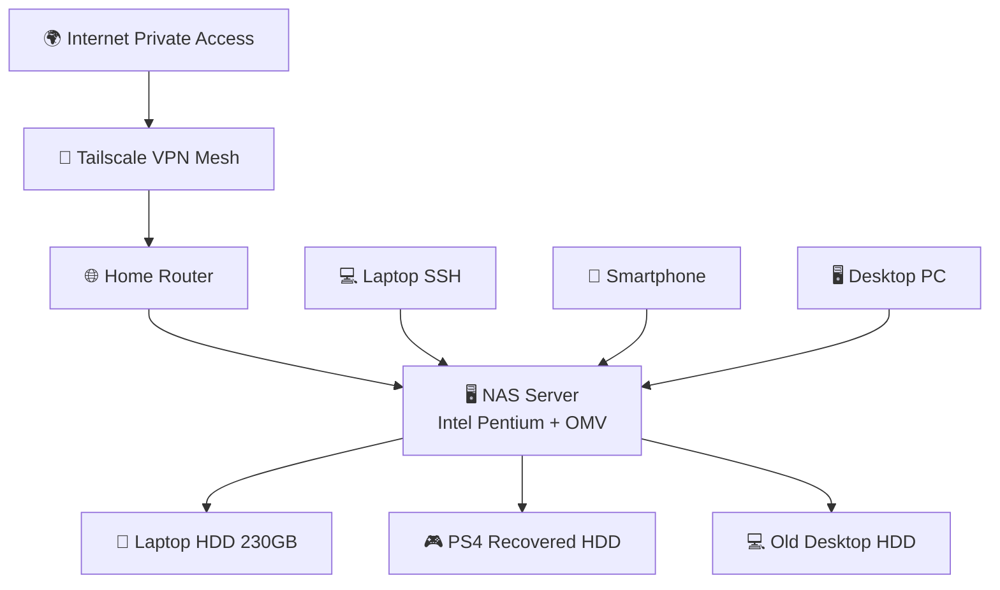

# System Architecture

## Overview

The system is composed of repurposed legacy hardware configured into a lightweight NAS infrastructure.

## Components

- NAS Node: Intel Pentium desktop running OpenMediaVault
- Storage Node: 230GB HDD from Intel Atom laptop (NTFS)
- Network: Local LAN via router
- Remote Access Layer: Tailscale VPN mesh network

## Data Flow

Client Device → Tailscale VPN → NAS → Storage Disk

## Design Principles

- Minimal cost
- Hardware reuse
- Remote accessibility without public exposure
- Simplicity over performance

## Architecture Diagram in Mermaid
