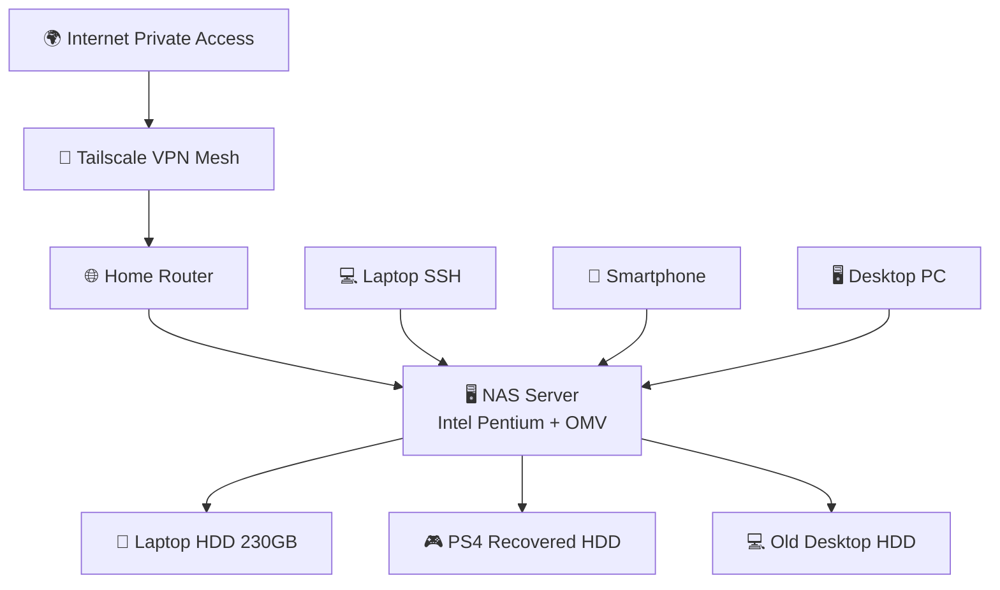

# System Architecture

> [!NOTE]
>In questa sezione viene documentata l'architettura complessiva del sistema NAS, con un focus sui componenti hardware, la topologia di rete e il flusso dei dati.

## Overview
Il sistema è composto da hardware legacy riutilizzato, configurato in un'infrastruttura NAS leggera.

## 01. Logica di Flusso

Il sistema opera come un nodo centrale in una rete a stella:

1. **Data Layer:** Basato su Linux (Lubuntu) con OpenMediaVault per la gestione dei permessi SMB.
2. **Access Layer:** Tunneling cifrato punto-punto tramite Tailscale.
3. **Control Layer:** Amministrazione via SSH (CLI-first).

## Data Flow

Client Device → Tailscale VPN → NAS → Storage Disk

## 02. Design Principles

- Minimal cost
- Hardware reuse
- Remote accessibility without public exposure
- Simplicity over performance

## 03. Architecture Diagram in Mermaid

