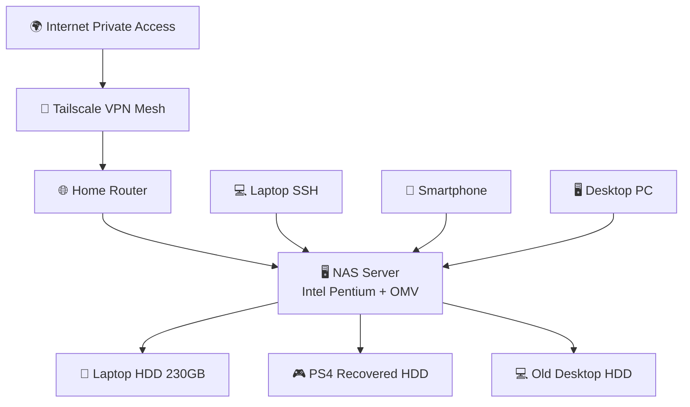

# Network Configuration

## Local Setup

- Wired LAN connection
- Router-based network
- Static IP recommended for NAS

## Remote Access

- Tailscale VPN mesh network
- SSH access enabled

## Security

- No exposed ports
- Access only via VPN
- SSH key authentication
- Custom local DNS naming for ease of access

# Mermaid tecnico
