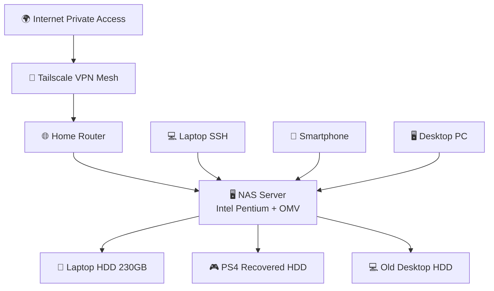

# Network Infrastructure & Connectivity

## Strategia di Accesso Remoto

La sfida principale è stata garantire l'accesso al NAS da smartphone e laptop esterni alla rete locale senza esporre il dispositivo a attacchi diretti.

### 🛡️ Zero-Exposure (Tailscale)

Invece di utilizzare il port forwarding sul router (che espone la porta SSH o HTTP al pubblico), è stata implementata una **Mesh VPN basata su Tailscale (WireGuard)**.

- **Vantaggio:** Il NAS non ha porte aperte verso l'esterno.
- **MagicDNS:** Configurato per assegnare un nome mnemonico (es. `nas-homelab`) al posto dell'IP dinamico della VPN.

### 🌐 Configurazione LAN Locale

- **IP Statico:** Assegnato a livello di router per garantire che la WebUI di OMV e l'accesso SSH siano sempre raggiungibili allo stesso indirizzo all'interno della rete domestica.
- **DNS Locale:** Implementato per facilitare il mapping dei servizi senza dover ricordare gli indirizzi IP.

---

## Remote Management (Termius)

Per la gestione in mobilità, è stato scelto **Termius** (sfruttando il GitHub Student Developer Pack).

- **Integrazione:** Le chiavi SSH sono sincronizzate tra i dispositivi.
- **Accessibilità:** Possibilità di monitorare i log di sistema e gestire i file tramite SFTP direttamente da smartphone sotto rete 5G via Tailscale.

# Mermaid tecnico

